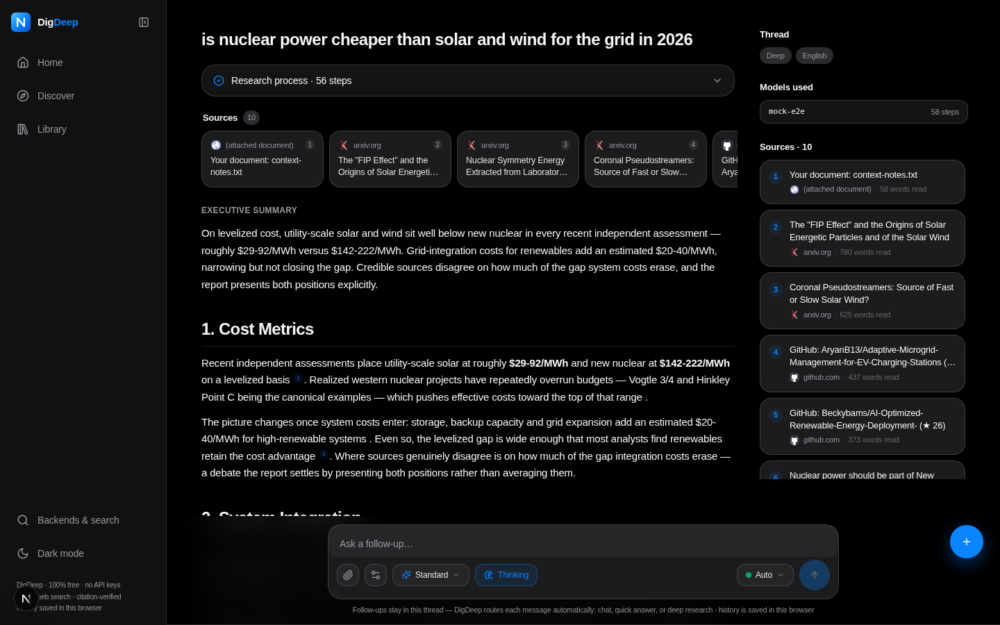
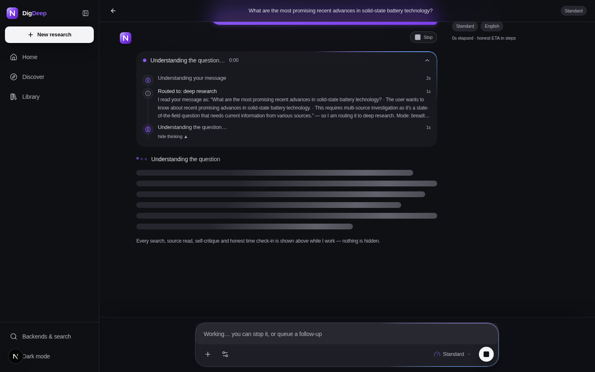
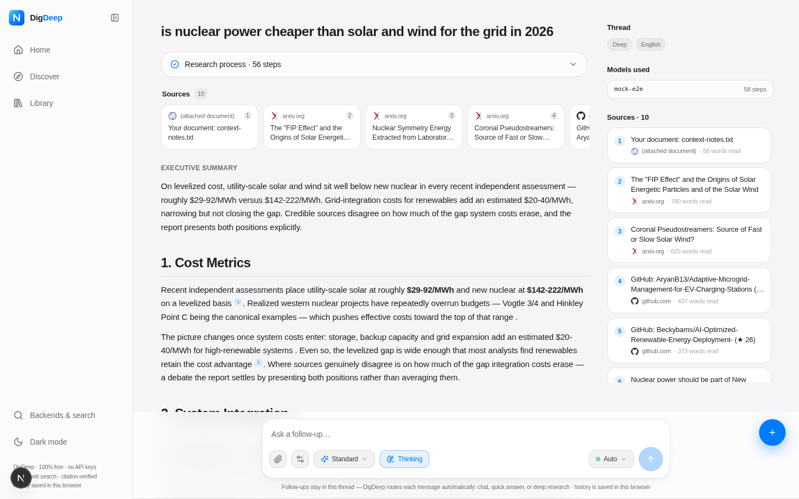
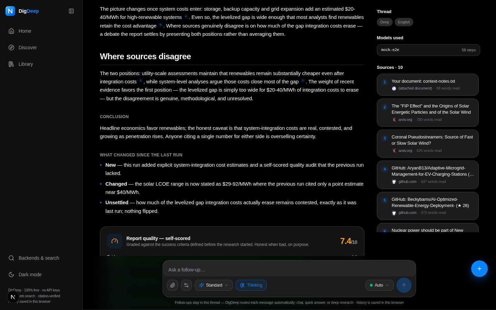
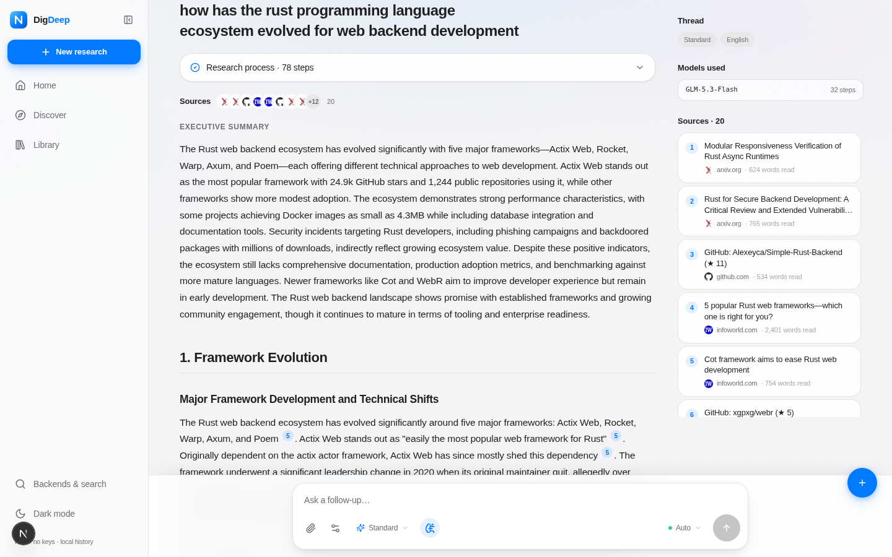
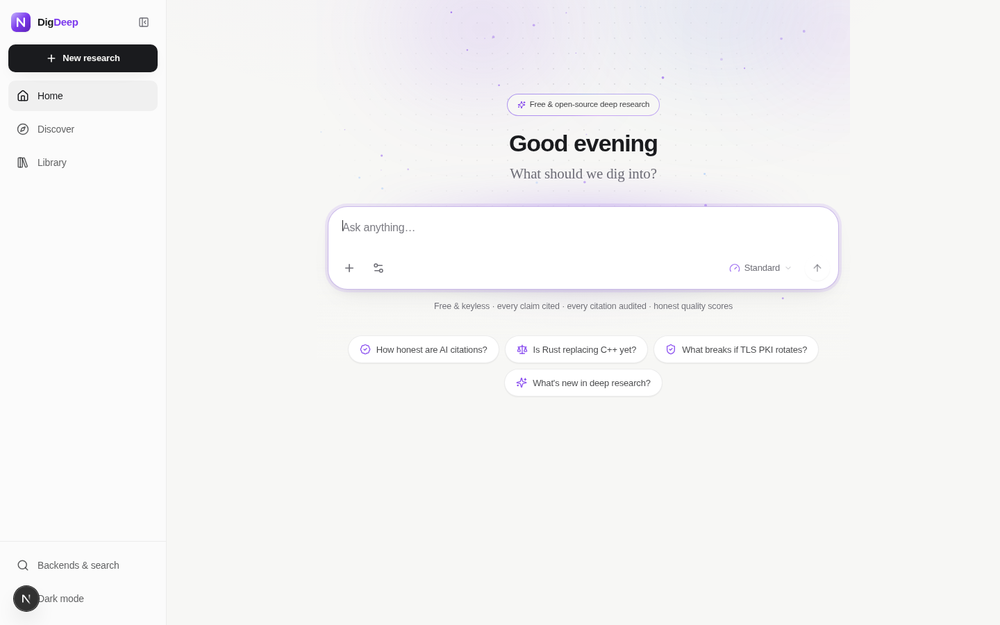
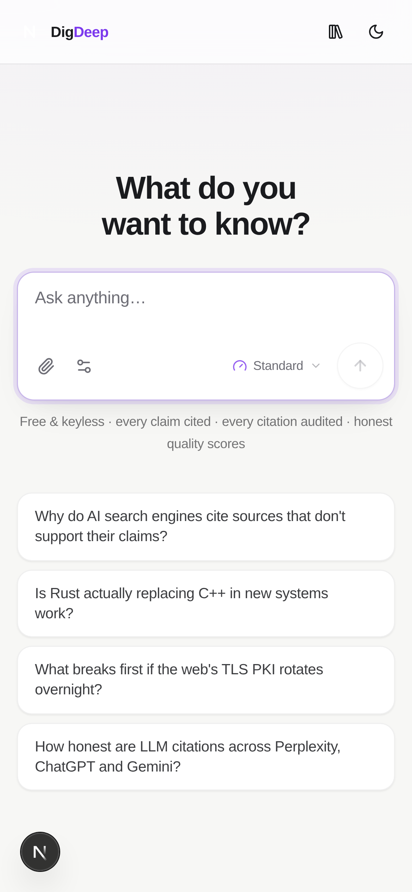

# digdeep

**A free, open-source deep research engine. It thinks where you can see it, audits its own citations, grades its own reports — and never pretends to know.**

[](https://nextjs.org)
[](https://www.typescriptlang.org)
[](https://tailwindcss.com)
[](https://www.prisma.io)
[](#testing--benchmarks)
[](LICENSE)

<p align="center">
  
</p>

---

## Why digdeep exists

Independent audits keep finding the same weakness in AI research tools: confident prose, broken citations. The Tow Center's 2025 study found that AI search engines failed to properly support their claims with accurate, verifiable citations more than **60% of the time**. Meanwhile, commercial "deep research" products are opaque (you can't see what they did), metered (paywalled minutes), and silent about their own failures.

digdeep is built on the opposite bet: **the honesty is the product.** Where the others are confident, digdeep tries to be correct — and when it can't verify something, it says so, on the record, inside the report itself.

Concretely, every digdeep report:

- shows its **whole reasoning process live** — routing thoughts, plans, searches, reads, doubts
- **audits every citation** against the text it actually read, and publishes the integrity percentage
- **grades itself** on evidence, coverage, honesty, and clarity — and shows the grade even when it's bad
- lets a **red-team agent attack** its own findings before writing, and a **proposer-vs-skeptic debate** settle contested claims
- reports the **diversity and freshness** of its sources, and warns you about echo chambers

And it does all of this **keyless and free by default**.

---

## What it does

Ask anything. digdeep routes your message through three lanes:

| Lane | For | Behavior |
|---|---|---|
| **Chat** | Small talk, capability questions ("what can you do?") | Answered instantly via zero-latency heuristics — no research wasted |
| **Quick** | Simple lookups ("wandering albatross wingspan") | One focused pass, a fast cited answer |
| **Research** | Open, multi-faceted questions | A full multi-source report with verification and self-grading |

Routing is *understanding-first*: before a lane is chosen, the model restates what you actually meant — and that understanding streams into the UI in real time, the moment it thinks it. If the router is ever wrong, you see why, immediately.

Questions about digdeep itself ("what engines do you have?", "how does your research work?", "i mean the engines, not the AI model") never touch the web — they're answered instantly from a grounded, always-accurate product-knowledge spec (all 13 engines by name, the 10-stage pipeline, the model chain), the way a product should know itself. Chat craft follows the Claude Fable 5.1 school: every sentence adds something, no repetitive sign-off invitations, corrections get owned in a few words and then answered precisely.

## Feature highlights

### Research that checks itself

- **Quote-anchored citation audit** — every `[n]` in a finished draft is checked for lexical support against the excerpt that was actually read from that source. Weak anchors go to a judge that re-anchors them to the right source or drops them. The final **integrity % is published on the report** (a live run: 8 citations audited, 1 re-anchored, 1 dropped, 88% integrity).
- **Self-scored quality** — the finished report is graded against its own comprehension-pass success criteria on four dimensions (evidence, coverage, honesty, clarity), with per-criterion pass/fail and a "biggest weakness" note. Shown even when the grade is poor.
- **Adversarial red-team pass** — before writing, a hostile reviewer attacks the weakest claims in the findings. Drafts must answer, hedge, or attribute every attack.
- **Multi-agent debate** — genuinely contested claims (max 2 per run) get a proposer and a skeptic arguing over fresh evidence, with a judge verdict: supported, refuted, or unsettled. Refutations with corrections flow into the report's disagreements section.
- **Diversity & freshness analytics** — domain distribution across sources, an echo-chamber warning when one domain exceeds 40%, and the median source age in months (a live run: 9 sources, 5 domains, median age 3 months).

### A real search stack — no API keys required

- **Whole-web engines (keyless):** DuckDuckGo (process-wide pacer with anomaly cooldown), SearXNG (public instances + your own, with per-instance failure memory), Mojeek, Marginalia
- **Optional keyed engines:** Brave Search (2k/month free tier) and Google CSE (100/day free tier) — add keys in Settings, never required
- **Vertical engines:** Bing News, Wikipedia, arXiv, Crossref, Hacker News, Stack Overflow, GitHub
- **LLM rerank** — when candidates exceed read slots, the model reranks them *with publication dates visible*, so fast-moving topics prefer fresh evidence; failures fall back to heuristic order
- **Publication dates** captured across engines, powering the freshness analytics

### Engine mechanics

- **Claude-style comprehension pass** — before researching, the engine restates the question, names the intent, defines success criteria, surfaces ambiguities, and splits sub-questions — all visible live
- **Parallel aspect workers** — sections are researched concurrently (2 workers on budgeted presets, 3 on exhaustive/unlimited), with parallelism-aware ETAs and per-aspect failure isolation
- **Learnings accumulation + breadth decay** — each research round feeds what was already learned into the next, while narrowing the search breadth; reflections spawn targeted follow-up queries
- **Expert role adoption** — each run adopts a domain-expert persona with explicit biases to distrust (vendor marketing, single-source claims)
- **Monitoring-lite** — re-run any question in a thread and get a "What changed since the last run" section (new / changed / unsettled)
- **Local documents as ground truth** — attach up to 4 `.txt` / `.md` / `.csv` / `.json` files; they become first-class cited sources (`[1000+]`) injected into every research round

### Honest by design

- **Honest timing** — "Thought for 14s" means 14 seconds, not marketing math
- **Unlimited mode** — no time budget, no source cap, until the question is actually answered
- **Throttled models are labeled**, never silently swapped
- **Every quality number is published** — including the unflattering ones

### Local-first, bring-your-own-key optional

- Threads live in **IndexedDB in your browser**; jobs, sources, and events in server-side PostgreSQL
- Default model chain: **GLM-5.3-Flash → GLM-4.5-Flash** (z.ai SDK) with keyless failover to **LLM7** and **Pollinations**, behind a health/circuit-breaker layer
- **BYOK frontier synthesis** — plug your own OpenAI / Gemini / DeepSeek / Groq key and it is used *only* for report-writing steps, with the free chain as failover; add any OpenAI-compatible endpoint in Settings → Backends

### Design

An Apple-grade interface, built on the Human Interface Guidelines: the SF Pro type stack, an 8pt grid, glass materials (`blur(20px) saturate(180%)`), system-blue accent, spring motion curves, 44px touch targets, true-black dark mode, and a fully responsive mobile layout.

<p>
  
  
</p>
<p>
  
  
</p>
<p>
  
  
</p>

---

## How it works

The pipeline, stage by stage. Everything in the left column is streamed live into the UI.

| Stage | Name | What happens |
|---|---|---|
| 0 | **Route** | Instant heuristics catch chat-shaped messages (zero LLM latency); everything else goes to an understanding-first classifier that restates your intent and picks a lane — with its reasoning visible as it thinks |
| 1 | **Comprehend** | Claude-style read of the question: restate, intent, success criteria, ambiguities, sub-questions — plus an expert role to adopt for this run |
| 2 | **Plan** | Report type, section-aspects, initial queries |
| 3 | **Research (parallel)** | Per-aspect worker pool: whole-web + vertical search, diversity-aware selection, LLM rerank, parallel page reads, cited synthesis, reflection with accumulated learnings and breadth decay |
| 3.4b | **Debate** | Contested claims argued proposer-vs-skeptic over fresh evidence; judge verdicts recorded |
| 3.7 | **Red team** | Hostile reviewer attacks the weakest findings; drafts must answer, hedge, or attribute |
| 4 | **Draft** | Section drafts with `[n]` citations; cross-verification of unclear claims; disagreements surfaced, not averaged away |
| 4.5 | **Citation audit** | Every `[n]` verified against the excerpt actually read; weak anchors re-anchored or dropped; integrity % computed |
| 5 | **Grade & assemble** | Self-score on 4 dimensions + biggest weakness; executive summary; conclusion; references renumbered; monitoring diff when re-run |
| 6 | **Deliver** | Markdown report, MD/PDF export, stats, quality card, trust chips (domains, median age, red-teamed, debated) |

Presets scale the pipeline: **quick**, **standard**, **deep**, **exhaustive**, **custom** — plus **Unlimited**, which removes the time budget and source cap entirely.

## Architecture

```
src/
  app/
    page.tsx                        # thread UI (Perplexity-style, Apple design language)
    api/research/route.ts           # POST create job · GET list
    api/research/[id]/route.ts      # GET SSE stream (events + token deltas) · DELETE cancel
    api/research/[id]/export/       # MD + PDF export
    api/settings/route.ts           # presets, engines, keys, backends
    api/trending/route.ts           # home-screen suggestion chips
  components/
    pplx/                           # ask box, turns, steps card, sources row, answer, logo
    research/                       # activity feed, sources panel, report view, markdown renderer
    ui/                             # shadcn/ui primitives
  lib/
    research/engine.ts              # the multi-stage pipeline
    research/llm.ts                 # backend registry: GLM SDK + keyless pool + BYOK, health & cooldowns
    research/search.ts              # 13 engines (6 whole-web + 7 vertical), pacers, settings
    research/prompts.ts             # every prompt in the pipeline
    research/intent-heuristics.ts   # zero-latency chat detection
    db.ts / idb-store.ts            # Prisma (server) · IndexedDB (client threads)
  hooks/                            # use-typer (streaming type), use-mobile, use-toast
prisma/schema.prisma                # ResearchJob, ActivityEvent, Source, ResearchSection, Setting
scripts/
  test-routing.ts                   # 67-case routing suite (bun)
  mock-llm.js                       # deterministic OpenAI-compatible mock server for E2E
  benchmark-harness.mjs             # BrowseComp / DeepResearch-Bench-style self-benchmark
  bench/questions.jsonl             # benchmark question set
docs/screenshots/                   # the images in this README
```

**Tech stack:** Next.js 16 (App Router) · TypeScript (strict) · Tailwind CSS 4 · shadcn/ui · Prisma + PostgreSQL · SSE streaming · IndexedDB · z-ai-web-dev-sdk (GLM)

## Quickstart

Prerequisites: [Bun](https://bun.sh) 1.1+ (recommended; `bun.lock` is committed) or Node 20+ / npm.

```bash
git clone https://github.com/mahmoudmohamedxx1-hue/digdeep.git
cd digdeep
bun install
cp .env.example .env      # local Postgres URL — no API keys needed
bun run pg:start          # boot the bundled dev Postgres on :5433 (no install needed)
bun run db:push           # create the database schema
bun run dev               # http://localhost:3000
```

The dev database is a **self-contained embedded PostgreSQL** (no system install, no Docker) that stores its cluster in `db/pgdata/` — the same provider as production, so what you test locally is what runs on Vercel. `bun run pg:stop` shuts it down.

**About the model backends.** The default chain works out of the box anywhere the z.ai SDK is available. Everywhere else, digdeep automatically fails over to keyless public endpoints (LLM7, Pollinations) — and you can register **any OpenAI-compatible endpoint** (with or without an API key) under Settings → Backends, including BYOK presets for OpenAI, Gemini, DeepSeek, and Groq. No key is ever required to use the app.

**Production build:**

```bash
bun run build && bun start
```

## Deploying to Vercel (PostgreSQL)

digdeep runs serverlessly on Vercel with a Vercel Postgres database:

1. **Create the database** — in your Vercel project, open **Storage → Create Database → Postgres** and link it to the project.
2. **Push the schema once** from your machine (or the Vercel CLI):
   ```bash
   DATABASE_URL="<your pooled connection string>" bun run db:push
   ```
   The pooled URL (the one ending in `?pgbouncer=true&connection_limit=1`) is the right one for serverless.
3. **Nothing else to configure** — when you deploy, Vercel injects `POSTGRES_URL` / `POSTGRES_PRISMA_URL` automatically and digdeep picks them up (`DATABASE_URL` also works if you prefer to set it explicitly). `prisma generate` runs automatically on every deploy via the `postinstall` script.

The database stores research jobs, activity events, sources, sections, and settings — so deep links (`/r/<id>`) keep working across restarts and deployments.

## Configuration

| Setting | Where | Notes |
|---|---|---|
| `DATABASE_URL` | `.env` | PostgreSQL connection string (Prisma); Vercel's `POSTGRES_URL` / `POSTGRES_PRISMA_URL` are picked up automatically |
| Research preset | Ask box | quick · standard · deep · exhaustive · custom · unlimited |
| Search engines | Settings → Search | Toggle any of the 13 engines; add SearXNG instances |
| Brave / Google CSE keys | Settings → Search | Optional; free tiers supported |
| LLM backends | Settings → Backends | Add OpenAI-compatible endpoints; BYOK presets; "synthesis" role routes report-writing to your key with free failover |

## Testing & benchmarks

**Routing suite — 67/67 passing.** Meta-questions, capability questions, greetings, and real research questions (including tricky ones with "you" in them) must route correctly:

```bash
bun run test:routing
```

**Deterministic E2E.** `scripts/mock-llm.js` is an OpenAI-compatible mock that pattern-matches prompts and returns purpose-built responses, so the entire pipeline (parallel workers, rerank, debate, red-team, citation audit, self-score, attachments, monitoring diff) can be verified end-to-end without any network:

```bash
bun run mock-llm    # 127.0.0.1:8787 — then register it in Settings → Backends
```

**Self-benchmark.** A BrowseComp / DeepResearch-Bench-style harness runs the question set through the live engine and scores keyword coverage, citation integrity, and self-score:

```bash
bun run bench                                          # built-in set, quick preset
node scripts/benchmark-harness.mjs --preset standard --only drb-001,drb-002
```

Honesty note: early runs on the quick preset average ~52% keyword coverage. That number is published deliberately — an honest baseline beats a marketing number, and the harness is right there so you can reproduce (or beat) it.

## Roadmap

**Shipped in v1.0.0**

- **P0** — whole-web keyless search layer (6 engines), parallel aspect workers, LLM rerank with freshness, quote-anchored citation verification with published integrity %
- **P1** — self-scored quality dashboard, adversarial red-team pass, diversity + recency analytics, benchmark harness
- **P2** — multi-agent debate, monitoring-lite re-run diffs, local document ingestion, BYOK frontier synthesis

**Next**

- Embedding-based reranking and semantic (not just lexical) citation verification
- Scheduled monitoring: subscribe to a question, get diff digests on a cadence
- More export targets (DOCX, Notion) and report templates
- Multi-user auth and shared thread links

## Contributing

Issues and pull requests are welcome. Before submitting, please run:

```bash
bun run lint
bun run test:routing
```

Two house rules for changes to the engine: **never remove an honesty mechanism** (citation audit, self-score, throttled-model labels, honest timing), and **never add a silent failure** — degradation must always be visible to the user.

## License

[MIT](LICENSE) — © 2026 mahmoudmohamedxx1-hue

## Acknowledgments

- Research methodology informed by the public work on **WebWalker** (dual-critique loops), **gpt-researcher** (role adoption), and the published mechanics of Perplexity, ChatGPT Deep Research, and Gemini Deep Research
- The UI design language follows Apple's Human Interface Guidelines, with the glass/radius/typography ramp informed by [Tamoza4/apple-ui-design](https://github.com/Tamoza4/apple-ui-design)
- Free inference made possible by **GLM** (z.ai), with keyless failover from **LLM7** and **Pollinations**
